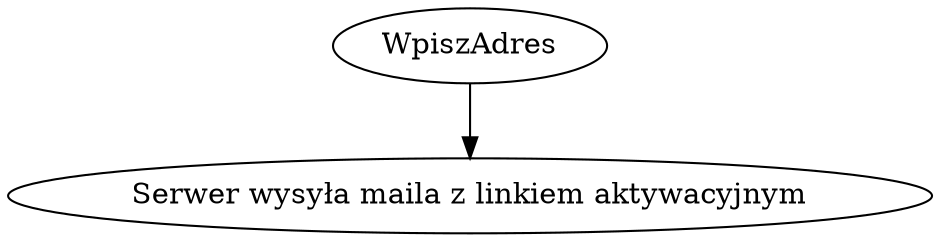

## Flow rejestracji userów

```graphviz
digraph RegisterFlow {
	WpiszAdres [text="Użytkownik wpisuje adres i nazwę restauracji"];
	WyślijMaila [label="Serwer wysyła maila z linkiem aktywacyjnym"];
	WpiszAdres -> WyślijMaila;
}
```
